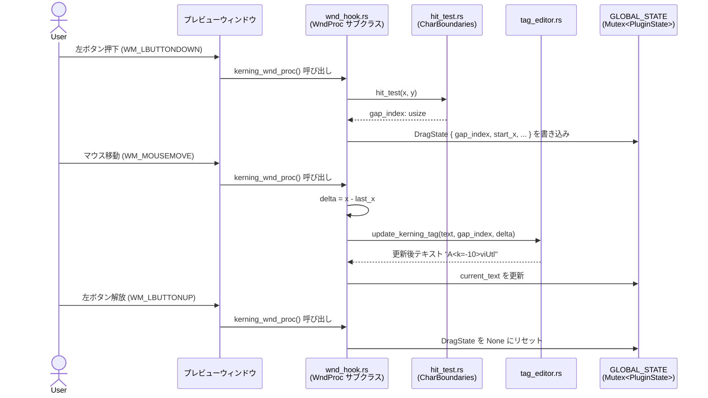
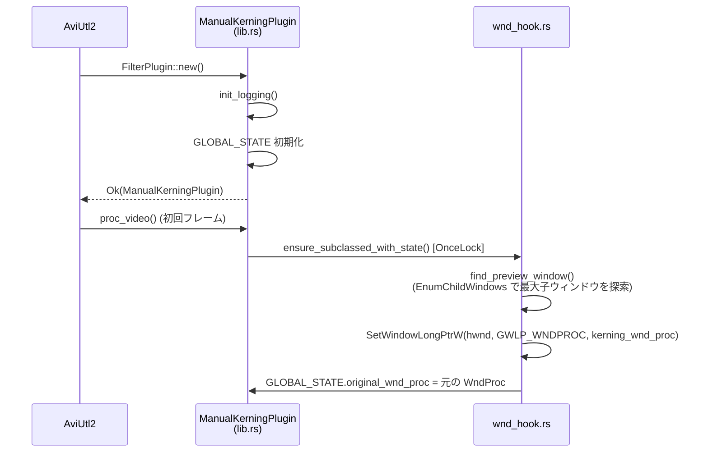
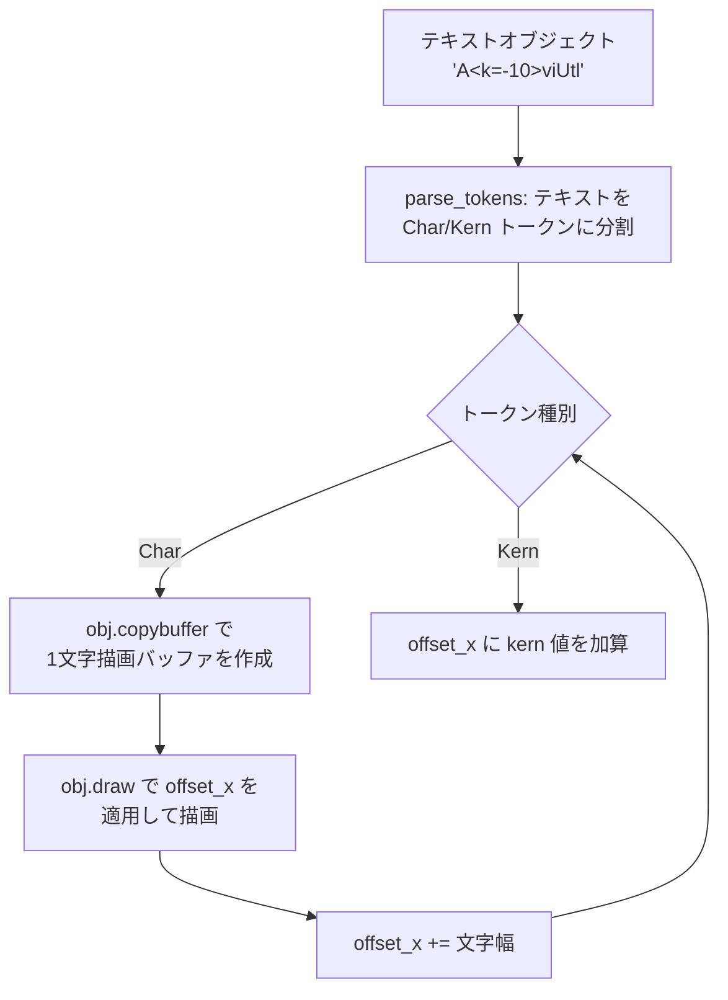
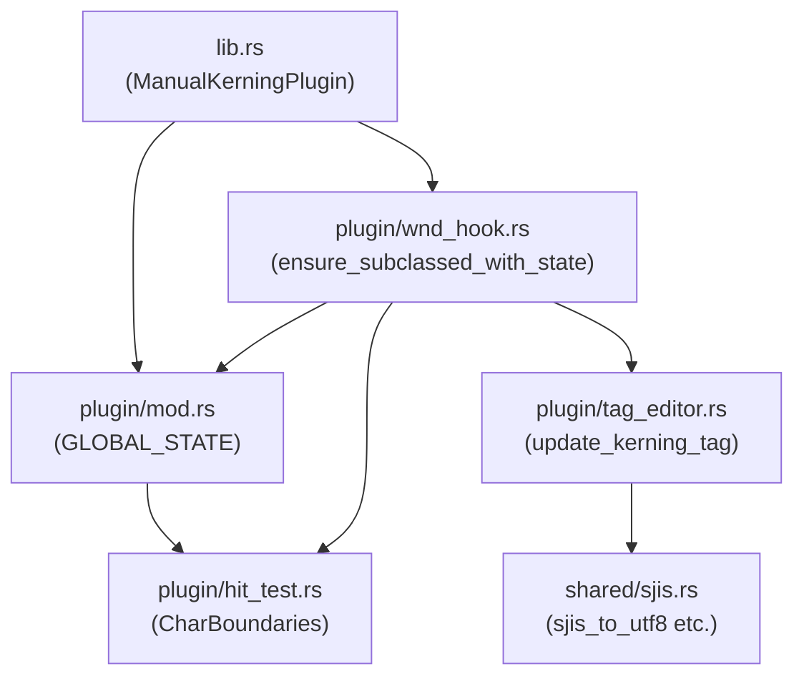

# AviUtl2 Manual Kerning Plugin - Architecture

## 概要

このプラグインは AviUtl2 のテキストオブジェクトのカーニング（文字間隔）を
マウスドラッグ操作で直感的に調整するための FilterPlugin + Lua アニメーション効果の組み合わせシステムです。

---

## システム構成

### コンポーネント一覧

| コンポーネント | ファイル | 言語 | 役割 |
| --- | --- | --- | --- |
| FilterPlugin | `src/lib.rs` | Rust | AviUtl2 プラグインのエントリポイント |
| WndProc フック | `src/plugin/wnd_hook.rs` | Rust | プレビューウィンドウのマウスイベント横取り |
| ヒットテスト | `src/plugin/hit_test.rs` | Rust | マウス座標 → 文字間インデックス変換 |
| タグ編集 | `src/plugin/tag_editor.rs` | Rust | `<k=XX>` タグの挿入・更新・削除 |
| SJIS ユーティリティ | `src/shared/sjis.rs` | Rust | Shift-JIS ↔ UTF-8 変換 |
| Lua レンダラー | `scripts/manual_kerning.anm` | Lua | `<k=XX>` タグを解釈してカーニングを適用 |

---

## データフロー図

### 1. カーニング調整フロー（ドラッグ操作）



### 2. プラグイン初期化フロー



### 3. Lua レンダラーによる描画フロー



---

## モジュール依存関係



---

## グローバル状態設計

`OnceLock<Mutex<PluginState>>` によるスレッドセーフなグローバル状態管理：

```
GLOBAL_STATE: OnceLock<Mutex<PluginState>>
                 │
                 └── PluginState
                       ├── drag: Option<DragState>         // ドラッグ中の状態
                       │     ├── start_x: i32
                       │     ├── start_y: i32
                       │     ├── gap_index: usize
                       │     └── last_x: i32
                       ├── current_text: String            // 現在のテキスト (UTF-8)
                       ├── boundaries: Option<CharBoundaries>  // ヒットテスト用
                       │     ├── x_positions: Vec<f32>
                       │     ├── y: f32
                       │     └── height: f32
                       └── original_wnd_proc: Option<isize>   // 元の WndProc ポインタ
```

---

## `<k=XX>` タグフォーマット

```
通常テキスト: "AviUtl"
カーニング適用後: "A<k=-10>v<k=5>iUtl"
                    │          │
                    │          └── v と i の間を +5px 広げる
                    └── A と v の間を -10px 縮める
```

- `XX` は符号付き整数（正値 = 広げる、負値 = 縮める）
- 値 0 の場合はタグを自動削除
- 連続する同一位置のタグは合算して正規化

---

## セキュリティ・安全性の考慮事項

1. **HWND を `isize` として保持**: `HWND` は `!Send` のため、グローバル状態には `isize` として保存し、使用時に `HWND(ptr as *mut _)` へキャスト
2. **OnceLock による初期化保証**: WndProc サブクラス化は `OnceLock` で一度だけ実行
3. **Mutex によるドラッグ状態の保護**: `GLOBAL_STATE` は `Mutex` で保護し、複数コールバックからの同時アクセスを防止
4. **Drop での WndProc 復元**: プラグインアンロード時に必ず元の WndProc を復元

---

## インストール手順

1. `cargo build --release` でビルド
2. `target/release/aviutl2_manual_kerning.dll` を AviUtl2 の `Plugin/` フォルダにコピー（`.auf` にリネーム）
3. `scripts/manual_kerning.anm` を AviUtl2 の `script/` フォルダにコピー
4. AviUtl2 を再起動してフィルタ「カーニング」を有効化
5. アニメーション効果「Manual Kerning」をテキストオブジェクトに適用

## 使用方法

1. ExEdit のテキストオブジェクトを選択し、アニメーション効果「Manual Kerning」を追加
2. フィルタ「カーニング」を有効化（プレビューウィンドウの WndProc がサブクラス化される）
3. プレビューウィンドウ上で文字間を左ドラッグして間隔を調整
4. ドラッグ方向: 右ドラッグ = 間隔を広げる、左ドラッグ = 間隔を縮める
